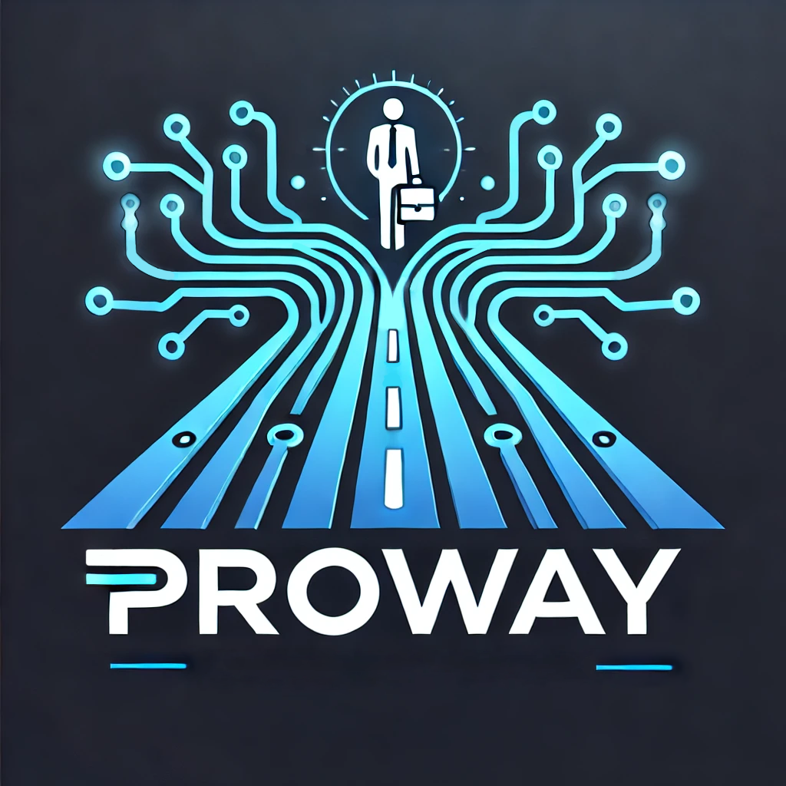

# 🚀 Дипломный проект: Разработка персонального интерактивного помощника процесса поиска работы специалистом (Flask + HeadHunter/YandexGPT)

  
*Краткое описание: система для помощи молодым специалистам в процессе поиска работы с интеграцией HeadHunter и YandexGPT*

## 🔥 Особенности
- Интеграция с API HeadHunter (поиск вакансий)
- Генерация текстов через YandexGPT
- Flask-интерфейс

## 🛠️ Стек технологий
| Технология       | Назначение               |
|------------------|--------------------------|
| Flask            | Бэкенд-фреймворк         |
| HeadHunter API   | Получение данных о вакансиях |
| YandexGPT API    | Генерация текстов        |
| Jinja2           | HTML-шаблоны            |
